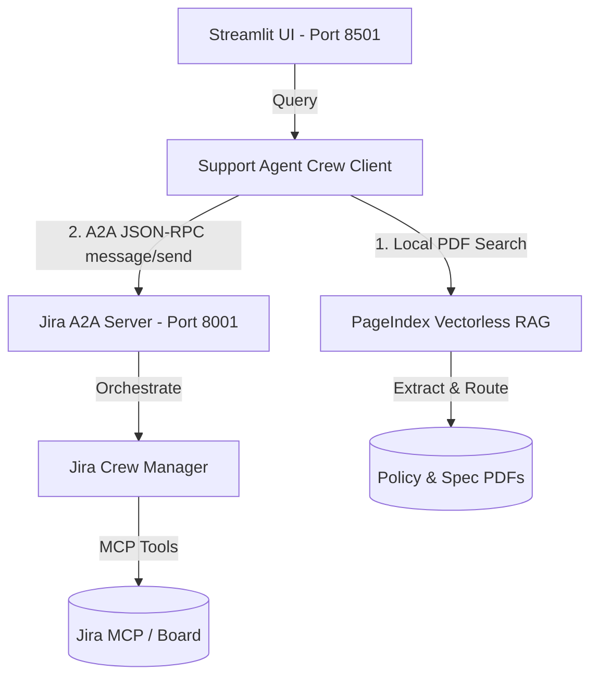

# A2A Jira Support Portal

A multi-agent demonstration showcasing Agent-to-Agent (A2A) protocol communication, native CrewAI A2A client integration, vectorless document RAG, and distributed tracing.

---

## Architecture Overview



- **Support Agent (Client)**: Streamlit chat interface (port `8501`). Resolves product specs/policies locally using PageIndex and delegates Jira tickets to the Jira Management agent over A2A.
- **Jira Management Agent (Server)**: FastAPI JSON-RPC service (port `8001`). Wraps the session4 Jira PM crew. Validates requests via static bearer token authentication.
- **Distributed Tracing**: Uses Confident AI (via `deepeval` SDK) for distributed tracing. Tracing contexts are propagated between client and server via standard W3C `traceparent` headers.

---

## Installation & Setup

1. **Synchronize Dependencies**:
   Navigate to the project root and run `uv sync` to sync virtual environment dependencies:
   ```bash
   uv sync
   ```

2. **Environment Variables**:
   Configure your environment variables in `.env` (or export them in your terminal):
   ```bash
   export MODEL_ID="bedrock/us.anthropic.claude-3-5-sonnet-20240620-v1:0"
   export ATLASSIAN_EMAIL="your-atlassian-email@example.com"
   export ATLASSIAN_API_KEY="your-atlassian-api-key"
   
   # For Tracing Observability (Optional)
   export CONFIDENT_AI_API_KEY="your-confident-ai-api-key"
   ```

3. **Pre-build PageIndex Tree Indexes (Optional)**:
   Pre-generate document indexes to speed up RAG operations:
   ```bash
   uv run python -m src.build_index
   ```

---

## Running the Services

### 1. Start the Jira A2A Server
Exposes the Jira crew on port `8001`:
```bash
uv run python -m src.jira_server.server
```

### 2. Start the Support Agent Web App
Runs the Streamlit interactive chat UI on port `8501`:
```bash
uv run streamlit run src/support_agent/app.py
```

---

## Testing the A2A Server using A2A Inspector

You can validate compliance and inspect JSON-RPC traffic on your local server endpoint using the local **A2A Inspector**:

1. Ensure the **Jira Management A2A Server** is running on port `8001`.
2. Open a new terminal window and clone the inspector repository:
   ```bash
   git clone https://github.com/enterprise-grade-agentic-ai/a2a-inspector
   cd a2a-inspector
   ```
3. Run the Inspector locally:
   * **Using Docker (Recommended)**:
     ```bash
     docker build -t a2a-inspector .
     docker run -d --rm --name a2a-inspector -p 5001:8080 a2a-inspector
     ```
   * **Using local scripts**:
     ```bash
     ./scripts/run.sh
     ```
4. Open `http://localhost:5001/` in your browser.
5. In the input box, enter the local agent endpoint: `http://localhost:8001/`.
6. Click **Inspect** to verify:
   - The public Agent Card gets fetched and validated.
   - You can send test queries (e.g. asking to inspect ticket status) and check JSON-RPC requests/responses in the inspector terminal/console.

---

## Running Unit Tests

Run the backend test suite using `pytest` to verify routing, card exposures, and authentication:
```bash
uv run pytest
```
