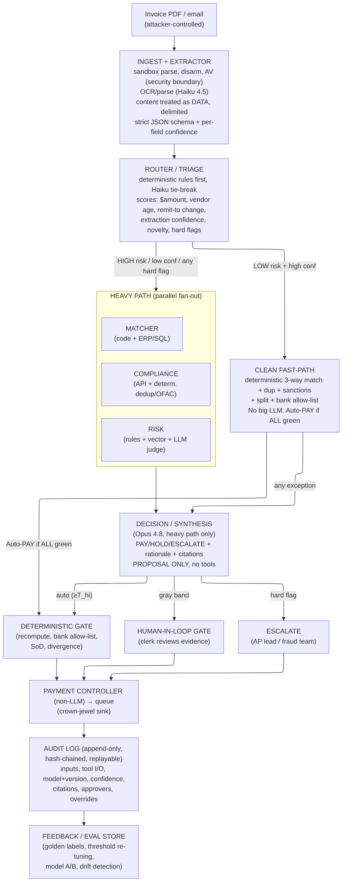

# Project 3: Ledger Lockdown - Reference Solution

A concise reference for hardening the naive invoice-to-payment pipeline. It covers the four dimensions in the problem statement: multi-agent pattern, evaluation, LLM strategy, and security.

---

## The one idea everything follows from

The baseline treats a 4,000-invoice/month payments system as one pipeline with one brain. A clean $40 reorder from a 5-year vendor and a first-time $48,000 invoice with a freshly-changed bank account take the identical 5-hop path and the same big model. That is too slow for the easy majority and too shallow for the dangerous minority.

Two principles drive the redesign:

1. Route work to the cheapest mechanism that can handle it correctly. Spend expensive reasoning and human attention only where the money and uncertainty actually are.
2. The LLM may read and reason. It may never be the sole authority that releases money, mutates the ledger, changes a bank account, or writes the audit record. Untrusted document on the left, irreversible money on the right, deterministic code plus humans in between.

The asymmetry that tunes everything: a fast wrong answer is worse than a slow right one. Paying a fraud is often unrecoverable. Holding a good invoice is annoying but recoverable. So we bias toward HOLD/ESCALATE on anything touching money movement, and reserve auto-PAY for the clean, low-dollar majority.

---

## 1. Multi-Agent Pattern

### Design principles

1. Triage first. A cheap router classifies every invoice before any expensive work.
2. Deterministic where possible, LLM where necessary. The 3-way match is arithmetic and joins. Duplicate detection is hashing and fuzzy match. Sanctions is an API call. None of these should be an LLM. Reserve the model for fuzzy work: OCR cleanup, field normalization, and final risk synthesis.
3. Parallel fan-out. Matching, Compliance, and Risk have no data dependency on each other. Run them concurrently. The baseline's serialization is pure latency tax.
4. Confidence- and dollar-tiered routing with a clean fast-path and a human-in-the-loop gate.
5. Privilege separation. Each agent gets only the tools it needs. The Extractor has no DB-write power. The Decision agent has no payment tool.

### Topology

### Deterministic code vs LLM: the dividing line

| Step | Mechanism |
|---|---|
| Document sandbox / disarm | Deterministic code (security boundary) |
| OCR + field extraction | LLM (Haiku 4.5 + vision) |
| Field normalization (dates, currency, IBAN checksum, VAT regex) | Deterministic code |
| Routing score | Deterministic rules, Haiku only to break ties |
| 3-way match | Deterministic code + ERP/SQL |
| Duplicate detection | Deterministic hash + fuzzy match, vector advisory |
| Sanctions / OFAC | Deterministic API + homoglyph-resistant matcher |
| Threshold-split + bank-change detection | Deterministic rules over history |
| Risk synthesis of soft signals | LLM judge (advisory) |
| Final decision + rationale | LLM (Opus 4.8, heavy path only), proposal only |
| Audit log write | Deterministic code |

The 3-way match is the single most important "do not use an LLM" call. Models do math wrong, occasionally and confidently. The heavy model runs on only the risky minority (~15-25%), never on all 4,000. The fast-path makes zero large-LLM calls.

### Tradeoffs (be honest)

We trade a simple linear pipeline for a router, fast-path, fan-out, deterministic gate, and human gate. That means more code paths, more failure modes, harder debugging. In a payments system this is justified only because the cost of a wrong payment dwarfs the engineering cost, and because the audit requirement already forces logging every step. Mitigations: keep router and match logic deterministic and unit-tested, version every component, re-apply content-as-data delimiting at every inter-agent hop, and make the entire decision replayable from the audit log. If you cannot replay it, you added complexity without the safety it was supposed to buy.

---

## 2. Evaluation: Measure Both Failure Modes, Optimize the Asymmetry

### The confusion matrix in AP terms

|  | Truly should PAY | Truly should NOT pay |
|---|---|---|
| System says PAY | True approve | False approve (paid fraud/dup). Catastrophic, often unrecoverable. |
| System says HOLD/ESCALATE | False hold (delayed a legit payment) | True hold (correct catch) |

### Which error is more expensive

- False approve: cash leaves the building, frequently irrecoverable. BEC funds are gone same-day. Add audit findings, SOX deficiency risk, regulatory exposure. "The AI did it" is not an acceptable answer to an auditor. This is the career-ending error.
- False hold: a legit invoice is delayed. Vendor calls, a supplier puts you on credit hold, you blow an early-pay discount, late fees pile up. Real and cumulative, but visible, bounded, and recoverable.
- The trap: if the system cries wolf, clerks rubber-stamp holds to clear the queue, and a real fraud sails through. Alert fatigue is itself a fraud risk. Hold precision matters, not just recall.

Verdict: evaluation is deliberately lopsided. Accept a higher false-hold rate to drive false-approve toward zero on high-dollar invoices.

### Metrics

- Recall on holds (fraud catch rate): primary safety metric.
- Precision on holds: guards against alert fatigue.
- Precision/recall on auto-PAY: auto-pay precision protects the cash.
- Cost-weighted expected $ loss: the metric that drives decisions.
  `Expected loss = Σ(false approves × invoice$ × P(unrecoverable)) + Σ(false holds × [late-fee + lost-discount + review-cost])`
  A false approve can be 100-1000x a false hold, so optimize cost-weighted error, not raw error count.
- $ exposure per tier: watch for fraudsters sizing invoices into the auto-pay band.
- Operational: auto-pay rate, human-review rate, time-to-decision, per-invoice cost, override rate per decision type.
- Security as first-class: attack-success rate and injection-detection recall against a red-team corpus.

### Labeled golden set

Versioned invoices with ground-truth label and reason (duplicate, bank-change fraud, threshold-split, qty mismatch, sanctioned party, clean). Sources: historical resolved invoices including post-hoc-discovered frauds, confirmed fraud cases, and synthetic adversarial cases (BEC remit-to changes, near-duplicates, splits just under threshold, OCR-mangled scans, plus the security red-team corpus). Stratify so rare-but-expensive fraud classes are over-represented. Otherwise the model optimizes the clean majority and quietly fails the cases that matter.

### Offline → shadow → online → feedback

- Offline: run every component and end-to-end against the golden set on every change. Gate on cost-weighted error and hold-recall. Regression-gate every change against the red-team corpus.
- Component evals: extraction field-accuracy (especially remit-to/IBAN/amount), match precision, dup recall, risk-score calibration.
- Shadow mode (mandatory before any change touches money): run the new model in parallel on live traffic, log decisions without acting, compare against production and clerk outcomes.
- Online: monitor live metrics plus ground truth that arrives later (disputes, auditor flags, discovered fraud).
- Feedback from overrides (highest-value signal): every gate decision is a free label. Auto-flag overrides that contradict a high-confidence auto-decision.

---

## 3. LLM Strategy: Tier by Difficulty and Stakes, Then Prove It

The baseline's "one big LLM does everything" is wrong in both directions: overkill for OCR cleanup, under-supervised for fraud reasoning.

### Model tiering

| Task | Model | Rationale |
|---|---|---|
| OCR cleanup / extraction / vision | Claude Haiku 4.5 (`claude-haiku-4-5`) | High volume, bounded difficulty, vision-capable, cheapest tier that works. Cost dominates here. |
| Triage tie-break (rules ambiguous) | Haiku 4.5 | Fast, cheap, rarely invoked. |
| Risk synthesis of soft signals | Claude Sonnet 4.6 (`claude-sonnet-4-6`) | Balanced reasoning for combining weak signals. |
| Final decision + rationale | Claude Opus 4.8 (`claude-opus-4-8`) | Highest-stakes reasoning plus auditor-facing explanation, on the risky minority only. |

Tune thinking/effort per tier: low/medium for extraction, high for the Opus decision step. Sweep effort on your own eval set rather than assuming maximum everywhere.

### Structured outputs everywhere

Every LLM step emits schema-constrained JSON. Extraction returns typed fields plus per-field confidence for the router. Decision returns `{decision, risk_score, exceptions[], citations[], rationale}`. This feeds deterministic routing, an auditable log, and shrinks the injection output surface. Injected prose cannot survive coercion into `total_amount: number`. Never parse free text.

### When to use deterministic rules over the LLM

The 3-way match, threshold-split detection, duplicate hashing, IBAN/VAT validation, and sanctions screening are all deterministic. An LLM is the wrong tool for arithmetic, exact lookups, and compliance-grade screening. The LLM's job is the fuzzy edges and the synthesis. If a step can be a rule or a query, make it a rule or a query.

### Validating the choice (don't assume bigger = better)

Build an eval harness. Decide empirically, per step, on three axes: accuracy (cost-weighted error, field accuracy), latency, cost per invoice.

- A/B and shadow each tier choice against the golden set and live traffic.
- Test whether Haiku-for-extraction actually loses field accuracy vs Sonnet. Usually it does not, and the cost delta over 4,000 calls is large. Test whether the decision step truly needs Opus.
- Promote a tier only when the eval shows it pays for itself.
- Re-run the harness on every model upgrade. Pin model and prompt versions in the audit log for replay.
- Smaller models on the fast path are more injection-susceptible, so compensate with stronger deterministic gates there.

### Provider unavailability: fail toward HOLD, never blind payment

- Multi-provider abstraction behind an interface. Fail over (Opus 4.8 → Sonnet 4.6 → secondary provider/region) with retry, backoff, and timeouts.
- Degraded mode: the deterministic path still works. If the LLM tier is down, stop auto-paying and route to the human gate. Failing toward HOLD is correct given the cost asymmetry.
- Queue and replay: the system is not minute-latency-critical (baseline is 9 days). Queue what cannot be processed and reprocess on recovery.
- Prompt caching on the stable system prompt and schema cuts cost and latency on the high-volume extraction calls.

---

## 4. Security: The Invoice Is Hostile Input to Your Most Powerful Interpreter

### The core inversion

In a normal app, input is data and the program is the trusted authority. Here the attacker-controlled PDF flows into a component (the LLM) that cannot reliably distinguish data from instructions, wired to privileged tools (ERP, SQL, payment queue). The invoice is hostile input to your most powerful interpreter.

### Crown jewels and trust zones

- Crown-jewel sinks: payment queue, remit-to/bank-detail change, audit-log writer.
- Untrusted: PDF bytes, OCR'd text, metadata, embedded objects, every extracted field, and anything retrieved from the vector DB.
- Semi-trusted: LLM output, a proposal, never a command.
- Trusted: deterministic verifiers, allow-lists, parameterized queries, append-only audit store.

### Attack catalogue

| Attack | Where it lands | Impact |
|---|---|---|
| Prompt injection (visible) in line-item/notes | Extractor → all downstream LLM context | Fraudulent PAY, risk suppression |
| Invisible injection (white-on-white, 1px, Unicode tags) | Extractor OCR/text layer | Same, invisible to a human |
| Metadata injection (PDF Title/Author, XMP, form defaults) | Extractor (forgotten channel) | Injection via a forgotten channel |
| Tool-call hijacking ("call update_bank_account") | Any agent with tools | LLM emits a privileged action |
| SQL injection via extracted field | Matcher/Compliance → SQL | Ledger tamper, dedup bypass |
| RAG / vector-DB poisoning | Compliance dedup, Risk RAG | Future invoices mis-scored |
| Data exfiltration via memo/URL | Decision/Risk LLM with read tools | Leaks vendor/payment data |
| Malicious file payload (CVE, zip bomb, XXE, OpenAction) | Extractor/parser host | RCE, DoS, SSRF |
| Homoglyph spoof (Cyrillic "АСМЕ", zero-width chars) | Compliance sanctions + dedup | Sanctions miss, dup evasion |
| BEC / bank-detail change (new IBAN in remit-to) | Extractor → payment queue | Real money to attacker |
| Threshold splitting (one $80k as 9x $9k) | Auto-approve path | Bypass approval gate |
| Duplicate billing (tweaked inv#/whitespace) | Compliance dedup | Double payment |
| Audit-log tampering | Audit writer | Decisions become deniable |

### Trust boundaries that must hold

1. Untrusted content vs trusted instructions: extracted text/metadata/OCR enters every LLM as clearly delimited data, never in the instruction channel.
2. LLM output vs privileged action: no LLM call directly triggers ERP writes, SQL mutations, payment release, or bank changes. The LLM produces a typed proposal. A deterministic gate executes or refuses.
3. Extracted field vs query engine: every field crossing into SQL/ERP is a bound parameter, never concatenated.
4. Vector DB is a poisonable store: retrieved content is untrusted data, advisory only.
5. Audit-log integrity: append-only, hash-chained, written by a deterministic service from validated objects.
6. Payment queue is the crown jewel: reaching it requires deterministic checks passed, allow-listed bank account, segregation of duties, and human approval for new payee/bank change.
7. Per-invoice isolation: fresh context per invoice, no shared mutable memory.
8. External APIs: each behind its own least-privilege credential and egress allow-list.

### Defenses (layered)

- Ingestion safety: sandboxed parse in an ephemeral, network-isolated container with CPU/mem/time caps (kills zip bombs, SSRF). Disarm the file (strip embedded JS, OpenAction, embedded files, disable XXE). Consider content-disarm-and-reconstruction (re-render to a flattened image). Pre-flight size/page/MIME/AV checks. Patch parser CVEs as P1.
- Content/instruction separation: all attacker-reachable channels (body, metadata, OCR, form fields, vector-DB chunks) go into a typed `untrusted_document` field with explicit framing. NFKC normalize, strip zero-width/bidi chars, flag mixed-script tokens. A lightweight injection detector routes flagged invoices to auto-ESCALATE, never auto-PAY.
- Structured extraction and schema validation: typed JSON only. Reject or escalate on schema violation.
- Deterministic verification of high-stakes facts (the heart): code, not an LLM, recomputes totals, runs the 3-way match, does homoglyph-resistant sanctions matching, deterministic dedup, and threshold-split aggregation.
- Least-privilege tools: no LLM has `release_payment`, `update_bank_account`, or write-SQL. A non-LLM Payment Controller validates the typed proposal against deterministic results plus allow-list plus policy, then enqueues. The LLM literally cannot reach the queue.
- Remit-to / BEC change control (the money shot): per-vendor bank-account allow-list. Any new payee or bank-detail change is a hard stop. It requires out-of-band verification (callback to a known-on-file number, not one from the invoice) plus dual human approval, non-overridable by any score. Even a perfect injection setting `risk=0, PAY` cannot move money to an account that is not on the allow-list.
- SQL layer: parameterized queries / allow-listed templates only. The SQL MCP rejects free-form LLM SQL by construction. Least-privilege DB accounts.
- Output guardrails: validate the decision schema. Divergence tripwire: if the deterministic layer says HOLD but the LLM says PAY, force ESCALATE plus alert. Scan outputs for exfil patterns before any side effect.
- Tamper-evident audit log: append-only, WORM/object-lock, hash-chained, written by a deterministic service. Records input PDF hash, extracted fields, check results, model+prompt+version, tool calls, decision, approver identities. Fully replayable.
- Org/ops: segregation of duties (initiator ≠ approver), rate limiting and anomaly detection per vendor, vault-managed short-lived per-agent secrets, mandatory HITL gates for new payee, bank change, over-threshold, sanctions/dup/split flag, divergence, or injection-detector hit.

### Framework mapping

OWASP LLM Top 10 (LLM01 injection, LLM02 insecure output handling, LLM03 RAG poisoning, LLM06 excessive agency, LLM08 vector weaknesses), OWASP A03 Injection, NIST AI RMF, SOX ITGC (segregation of duties, dual control, change-control on payee data), FBI/IC3 BEC out-of-band verification.

### THE top security risk and its defense

Prompt injection embedded in the invoice that drives the system to PAY a fraudulent invoice or reroute money to an attacker bank account (BEC). Highest likelihood times highest impact: the attacker controls the input, the LLM cannot natively tell data from instructions, and the sink is irreversible cash. No single control suffices, so the last line is deterministic, not the LLM:

1. Sanitize and delimit all channels (content as untrusted data).
2. Structured extraction plus schema validation (injected prose cannot survive as typed fields).
3. Injection detector routes to auto-ESCALATE, never auto-PAY.
4. Deterministic verification owns the facts. The LLM cannot inject `risk=0 → PAY`.
5. No payment/bank-change tool for the LLM. Output is a proposal. A non-LLM controller enforces policy.
6. Bank-account allow-list plus out-of-band verification plus dual human approval for any new payee or bank change.
7. Divergence forces ESCALATE. The tamper-evident log records the attempt.

Net effect: the only path to attacker money is "new/changed bank account," and that path is gated by out-of-band human verification no in-document text can bypass.

---

## 5. Bonus: Confidence Thresholds, Overrides, Feedback Loop

### Thresholds are a function of dollars and risk, not one global number

Two thresholds, three bands, scaled by amount and risk class:

- Auto-decide (confidence ≥ T_hi): system acts with no human. Raise T_hi as amount/risk rise. A $50 clean reorder can auto-pay at modest confidence. A $50k invoice or any bank change should require very high confidence or never auto-pay.
- Gray band (T_lo ≤ conf < T_hi): route to the human gate. Clerk attention spent only on genuine uncertainty.
- Escalate (below T_lo on a high-risk signal, or any hard trip): straight to fraud/AP-lead. Conflicting signals go to the manager.

Calibrate against cost-weighted error, not accuracy. Pick T_hi by sweeping it on the golden set and shadow traffic to minimize expected $ loss, subject to a hard cap on false-approve rate for high-dollar invoices (for example, near-zero false-approve on >$10k). Hard policy gates bypass auto-pay regardless of confidence.

### What happens on override

1. Act and audit: execute the human decision. Log reviewer ID, timestamp, original recommendation, confidence, and a structured reason code.
2. Label generation: every override is ground truth. Auto-flag overrides that contradict a high-confidence auto-decision.
3. Capture for the golden set, tagged by failure mode.

### How it feeds back (closed loop, gated by shadow mode)

- Threshold re-tuning: rising overrides in the auto-pay band means T_hi is too loose (or fraud/drift), so tighten and investigate. Very low overrides in the gray band may mean T_hi is too conservative.
- Model/prompt improvement: clustered override reasons point at specific weaknesses. Fix the prompt/rule, add the case to extraction eval.
- Drift/attack detection: override rate and the dollar distribution of auto-paid invoices are live monitors. A spike clustering just under the auto-pay ceiling means someone is probing the boundary.
- The loop: clerk override → label → eval set → offline eval → shadow → controlled rollout → monitor → repeat. No threshold or model change reaches production money until it passes offline eval and runs clean in shadow.

### What the end user signs off on

Every decision is explainable on one screen in 15 seconds: PAY/HOLD/ESCALATE, plain-language confidence (high/medium/low), the 3-way match line by line, every claim click-through citable to the PDF and matched record, exceptions named in English, and a deterministically replayable trail for the auditor. The system proposes rule changes for human approval and never silently self-modifies. Resolved-and-verified flags do not re-nag unless the detail changes again. Accountability sits with the company's control framework and a named human control owner, not "the AI."

Realistic turnaround: clean matches auto-approved same day, overall average from 9 days to 2-3 days, 80%+ of manual keying eliminated on standard invoices.

---

## Presentation cheat-sheet (the 4 asks)

1. Refined agent map: triage router → deterministic clean fast-path vs heavy parallel fan-out (Match / Compliance / Risk) → LLM decision proposal → deterministic gate plus human-in-the-loop → non-LLM payment controller → hash-chained audit log → feedback. Deterministic code owns all high-stakes facts.
2. Eval plan: cost-weighted expected $ loss, with false-approve driven to near-zero on high-dollar invoices and both directions tracked. Golden set plus red-team corpus, offline → shadow → online, override feedback.
3. LLM strategy: Haiku 4.5 (extraction) → Sonnet 4.6 (synthesis) → Opus 4.8 (decisions, risky minority only). Structured outputs, deterministic rules for math/lookups, validated by an eval harness plus shadow. Multi-provider failover that degrades toward HOLD, never blind payment.
4. Top security risk: prompt-injection-driven BEC payment, defended in layers whose last line is deterministic plus human. Content-as-data, schema validation, injection detector, deterministic fact verification, no payment tool for the LLM, and bank allow-list plus out-of-band verification plus dual approval that no in-document text can bypass.
